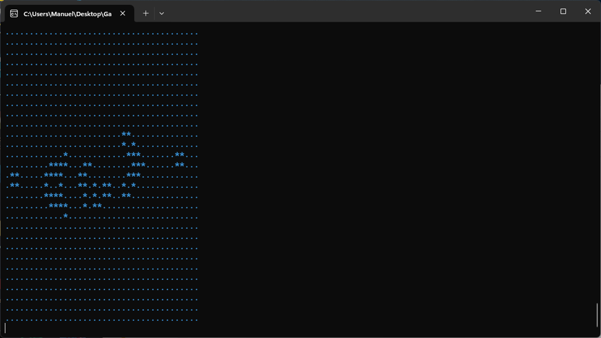

#Description

The Game of Life, also known as Conway's Game of Life or simply Life, is a cellular automaton devised by the British mathematician John Horton Conway in 1970. It is a zero-player game, meaning that its evolution is determined by its initial state, requiring no further input. One interacts with the Game of Life by creating an initial configuration and observing how it evolves. It is Turing complete and can simulate a universal constructor or any other Turing machine.

#Rules

The universe of the Game of Life is an infinite, two-dimensional orthogonal grid of square cells, each of which is in one of two possible states, live or dead (or populated and unpopulated, respectively). Every cell interacts with its eight neighbours, which are the cells that are horizontally, vertically, or diagonally adjacent. At each step in time, the following transitions occur:

    1. Any live cell with fewer than two live neighbours dies, as if by underpopulation.
    2. Any live cell with two or three live neighbours lives on to the next generation.
    3. Any live cell with more than three live neighbours dies, as if by overpopulation.
    4. Any dead cell with exactly three live neighbours becomes a live cell, as if by reproduction.
    
The initial pattern constitutes the seed of the system. The first generation is created by applying the above rules simultaneously to every cell in the seed, live or dead; births and deaths occur simultaneously, and the discrete moment at which this happens is sometimes called a tick. Each generation is a pure function of the preceding one. The rules continue to be applied repeatedly to create further generations.

*Text taken from [Wikipedia](https://en.wikipedia.org/wiki/Conway%27s_Game_of_Life "GameOfLife Wikipedia")*

#Implementation
I declere the libraries in `game.h` and i defined them in `game.c`; the main functions are `_sshort get_count_cells_alive_around(rid* grid, _sshort x,_sshort y)` and `void set_life(Grid* old, Grid* new)` that implements the algorithm of Game Of Life.

#How to Contribute
Clone the repository and change what you need to, then you compile with a compiler with Make, in my case i used MSYS2 package which has the make command and the gcc compiler, [link for installation](https://www.msys2.org/ "MSYS2").